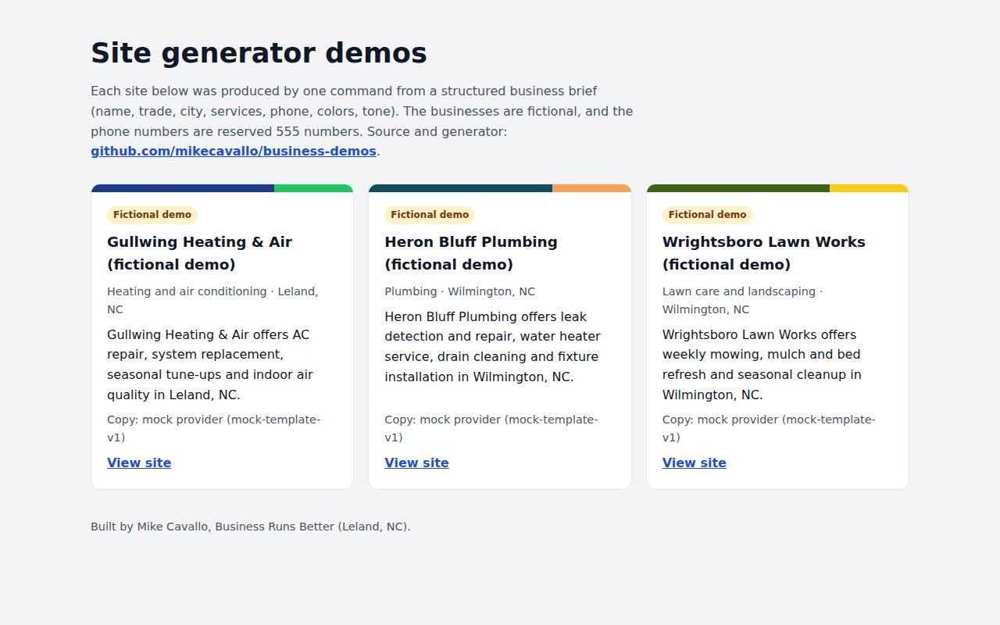
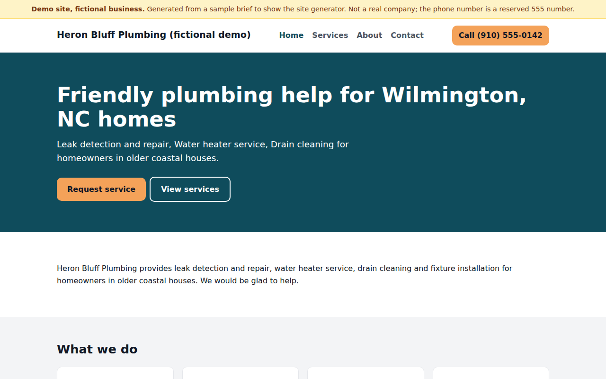
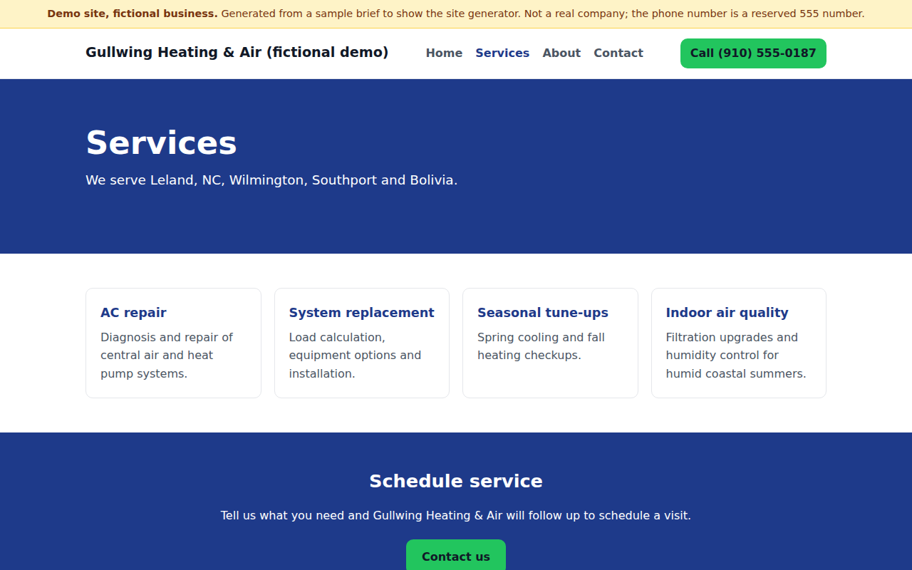
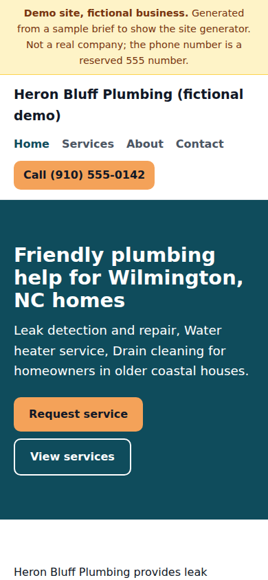
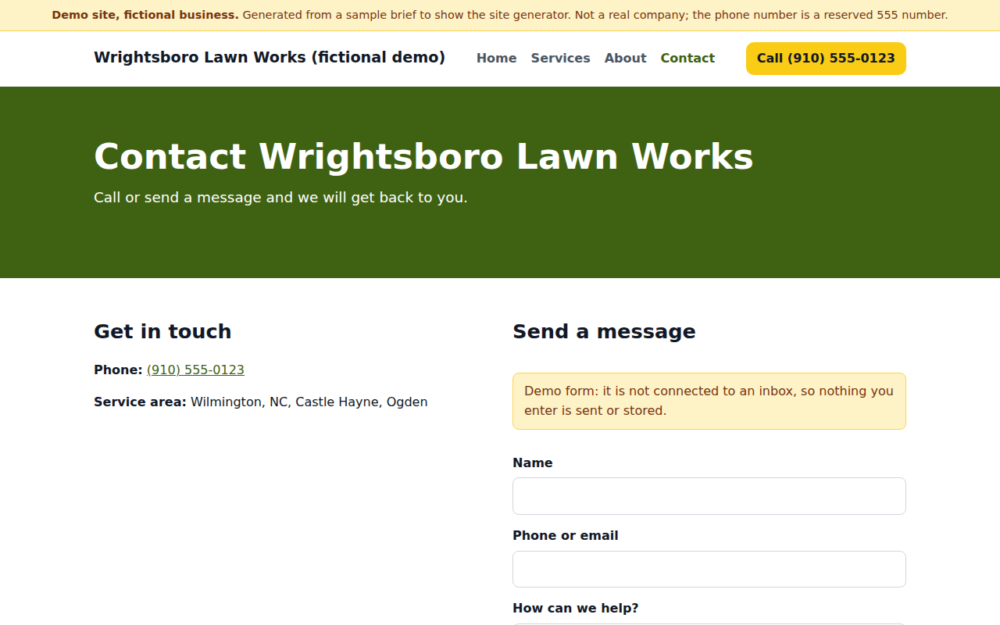

# business-demos

A small Node.js CLI that turns a structured business brief into a 4-page static website for a local service business, with copy written by an LLM and guardrails that stop the copy from inventing facts.



## What it does

```
brief.json  ->  generate  ->  sites/<slug>/{index,services,about,contact}.html + style.css
                                sites.json (manifest read by the root index.html)
```

- **Input:** a JSON brief with the business name, trade, city, service area, services, phone, colors and tone, plus optional email, hours, differentiators, credentials, founding year, reviews and a form endpoint.
- **Copy:** a provider writes the page text as JSON matching a fixed schema. Providers:
  - `anthropic` (default): Claude via the official `@anthropic-ai/sdk`, default model `claude-sonnet-5-5`, using structured outputs.
  - `openai` (optional): Chat Completions with a strict JSON schema, default model `gpt-5.5`.
  - `mock`: deterministic, template-based copy assembled from the brief. No network, no key. Used by tests, CI and the committed demos.
- **Guardrails:** generated copy is rejected, and the provider is re-prompted with the reasons (up to 3 attempts), if it:
  - mentions testimonials, reviews, ratings or stars
  - claims a credential (licensed, insured, certified, warranty, award, and similar) that the brief does not contain
  - contains any number (years, counts, percentages) that does not appear in the brief
  - uses unsupported superlatives ("top-rated", "#1", "trusted by")
  - contains a phone number or email (templates insert contact details from the brief)
- **Templates:** plain HTML and CSS, no build step, no external assets. Text color on brand colors is picked for contrast. Every value is HTML-escaped.
- **Reviews:** a Reviews section is rendered only when the brief includes `reviews`, and only with that text, attributed to the author and source given. The model never writes review text.
- **Contact form:** posts to `formEndpoint` (brief) or `--form-endpoint` (CLI) when set, for example a Formspree or Basin URL. Without one, the form shows a visible "demo form, nothing is sent" notice and a confirmation on submit; there is no dead `action="#"`.
- **Demo mode:** `"demo": true` adds a "Demo site, fictional business" ribbon on every page, a footer note and `noindex`.

## Demo sites

The three sites in `sites/` are for **fictional businesses** generated from the briefs in `briefs/`. They use reserved 555-01xx phone numbers and `.example` email domains.

| Site | Brief | Tone |
| --- | --- | --- |
| [Heron Bluff Plumbing](sites/heron-bluff-plumbing/) | `briefs/heron-bluff-plumbing.json` | friendly |
| [Gullwing Heating & Air](sites/gullwing-heating-air/) | `briefs/gullwing-heating-air.json` | professional |
| [Wrightsboro Lawn Works](sites/wrightsboro-lawn-works/) | `briefs/wrightsboro-lawn-works.json` | no-nonsense |

The committed copy was produced by the **mock provider**, so it is plainer than LLM output and CI can verify it byte for byte. Each site's `site.json` and its card on the index record which provider and model wrote it. Run the generator with `--provider anthropic` to see LLM-written copy for the same briefs.

| Home page | Services page (different brief and colors) | Mobile |
| --- | --- | --- |
|  |  |  |



## Make a site from a brief

Requires Node.js 20 or newer.

```bash
npm install

# Offline, no API key
node bin/generate.js --brief briefs/heron-bluff-plumbing.json --provider mock

# With Claude (default provider)
export ANTHROPIC_API_KEY=...
node bin/generate.js --brief my-brief.json

# With OpenAI
export OPENAI_API_KEY=...
node bin/generate.js --brief my-brief.json --provider openai

# Preview
npx http-server .   # then open http://localhost:8080
```

Minimal brief:

```json
{
  "name": "Example Pipe Co",
  "trade": "Plumbing",
  "city": "Wilmington, NC",
  "phone": "(910) 555-0100",
  "services": ["Drain cleaning", { "name": "Water heaters", "details": "Repair and replacement" }],
  "colors": { "primary": "#0f4c5c", "accent": "#f4a259" },
  "tone": "friendly"
}
```

Optional fields: `slug`, `serviceArea` (array), `email`, `hours`, `audience`, `differentiators` (strings or `{ "title", "detail" }`), `credentials` (array of strings), `yearFounded`, `reviews` (`[{ "author", "text", "source" }]`), `formEndpoint` (https URL), `demo` (boolean). `tone` is one of `friendly`, `professional`, `premium`, `no-nonsense`. The full set is shown across the files in `briefs/`. Only put real, verifiable facts and real reviews (with permission) in a brief for a real business.

CLI options:

| Option | Default | Purpose |
| --- | --- | --- |
| `--brief <file>` | required | Brief JSON |
| `--provider <name>` | `anthropic` or `$SITEGEN_PROVIDER` | `anthropic`, `openai` or `mock` |
| `--model <id>` | provider default | Override the model |
| `--out <dir>` | `sites` | Where sites are written |
| `--manifest <file>` | `sites.json` | Manifest rebuilt after each run |
| `--form-endpoint <url>` | from brief | Contact form POST target |
| `--manifest-only` | | Rebuild the manifest without generating |

## Environment variables

See `.env.example`. None are needed for the mock provider.

| Variable | Used by |
| --- | --- |
| `ANTHROPIC_API_KEY` | `anthropic` provider |
| `ANTHROPIC_MODEL` | optional override, default `claude-sonnet-5-5` |
| `OPENAI_API_KEY` | `openai` provider |
| `OPENAI_MODEL` | optional override, default `gpt-5.5` |
| `SITEGEN_PROVIDER` | default provider when `--provider` is omitted |

## Architecture

```
bin/generate.js          CLI (argument parsing, error output)
src/brief.js             brief validation and defaults
src/prompt.js            system prompt and per-brief user prompt
src/providers/           anthropic.js, openai.js, mock.js, index.js (lazy loading)
src/copy.js              copy JSON schema, shape validation, fabrication checks
src/render.js            HTML/CSS templates for the 4 pages
src/generator.js         generate -> validate -> retry -> render -> write; manifest builder
scripts/build-demos.js   regenerates sites/ and sites.json from briefs/ (mock provider)
index.html               lists sites from sites.json at runtime
```

## Scripts

| Command | What it does |
| --- | --- |
| `npm test` | Node test runner: brief validation, guardrails, rendering, providers (with fake SDK clients, no network), CLI end to end |
| `npm run lint` | ESLint |
| `npm run demos` | Regenerate the committed demo sites and `sites.json` |
| `npm run manifest` | Rebuild `sites.json` from `sites/*/site.json` |

## CI and deployment

- `.github/workflows/ci.yml`: lint, tests, then regenerates the demos and fails if they differ from what is committed.
- `.github/workflows/pages.yml`: publishes `index.html`, `sites.json` and `sites/` to GitHub Pages on pushes to `main`. Pages must be enabled in the repository settings with "GitHub Actions" as the source.

## Status

Working: brief validation, the three providers, guardrails with retry, the 4-page templates, the manifest and index, tests and CI.

Not yet implemented: images or a photo slot, multi-location businesses, custom page sets beyond the 4 pages, and an automated quality review of LLM copy beyond the fabrication checks. The Claude and OpenAI providers are covered by tests with fake clients; the committed demos were not generated with a live model.

## License

MIT. See `LICENSE`.
